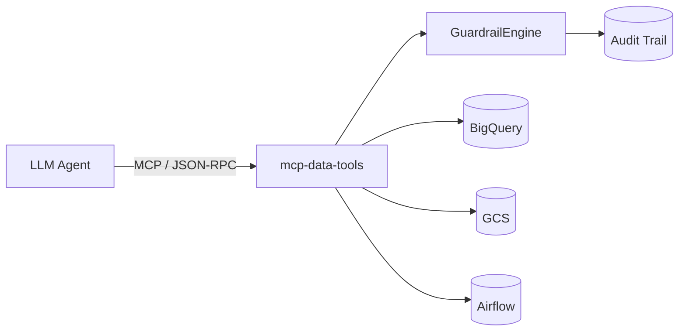

# mcp-data-tools

**A governed Model Context Protocol (MCP) server for data-platform operations.**

Give an LLM agent the ability to query BigQuery, inspect GCS, trigger
Airflow DAGs, and run data-quality checks — without giving it the ability
to scan an unbounded table, touch a dataset outside its remit, or run
anything but a read-only query. Every tool call is dry-run estimated,
checked against an explicit allow-list, capped by a cost/row ceiling, and
written to an audit trail before it ever reaches a real backend.

[](https://github.com/umamahesh-ade/mcp-data-tools/actions/workflows/test.yml)
[](https://github.com/umamahesh-ade/mcp-data-tools/actions/workflows/lint.yml)
[](https://github.com/umamahesh-ade/mcp-data-tools/actions/workflows/security.yml)
[](LICENSE)
[](pyproject.toml)

## Why this exists

Agentic data platforms (NL2SQL assistants, on-call/triage agents, data
copilots) all eventually hit the same problem: an LLM agent that can call
a real query engine is, by construction, an LLM agent that can be
prompt-injected or simply mistaken into running a full-table scan, reading
a dataset it shouldn't, or mutating data it was only supposed to read.
Most MCP servers for data tools wrap the backend SDK directly and call it
done. `mcp-data-tools` treats the guardrail layer as the actual product:

- **Allow-listed resources.** BigQuery tables, GCS buckets, and Airflow
  DAGs are matched against explicit glob patterns. Nothing is reachable by
  default.
- **Enforced read-only SQL.** A lexical check rejects anything that isn't
  a bare `SELECT`/`WITH`, with comments and string literals stripped first
  so neither can be used to smuggle a write statement past the check.
- **Two-phase table authorization.** A cheap preflight check denies
  obviously out-of-policy queries *before* any backend call — so an agent
  can't even use a dry run to probe the existence/schema of a
  non-allow-listed table — followed by an authoritative check against the
  backend's own dry-run result. See [`SECURITY.md`](SECURITY.md).
- **Real, enforced cost ceilings.** `max_bytes_billed` is passed straight
  through to the backend's execution API, so it holds even if a stale
  estimate undercounts a table that grew in the meantime.
- **A fail-closed audit trail.** Every decision — allowed or denied — is
  logged. If the audit sink itself is unavailable, the request is denied
  rather than let through unaudited.

## Architecture at a glance



Full component and sequence diagrams, plus the design decisions and
trade-offs behind them, are in [`docs/ARCHITECTURE.md`](docs/ARCHITECTURE.md).

## Tools exposed

| Tool | What it does | Guarded by |
|---|---|---|
| `bigquery_estimate_cost` | Dry-runs SQL, returns projected bytes/cost/tables — no data returned | Read-only check, table allow-list |
| `bigquery_query` | Executes a read-only SQL query | Read-only check, table allow-list, byte/row ceiling |
| `data_quality_check` | Runs `null_rate` / `uniqueness` / `freshness` / `row_count` checks against a table | Same as `bigquery_query`, per check |
| `gcs_inspect_object` | Fetches metadata for one GCS object | Bucket allow-list |
| `gcs_list_objects` | Lists objects under a prefix | Bucket allow-list |
| `airflow_trigger_dag` | Triggers a new Airflow DAG run | DAG-id allow-list |
| `airflow_get_dag_run_status` | Fetches a DAG run's status | DAG-id allow-list |

## Quick start

No cloud credentials required — this runs entirely against in-memory mock
adapters, the same ones the test suite uses:

```bash
git clone https://github.com/umamahesh-ade/mcp-data-tools.git
cd mcp-data-tools
python -m venv .venv && source .venv/bin/activate
pip install -e .
python examples/quickstart.py
```

You should see an allowed query, a data-quality report, a denied query
(hitting a table outside the allow-list), and the resulting audit trail —
all in a few dozen lines of output.

## Installation

```bash
pip install -e ".[dev]"          # base + testing/linting
pip install -e ".[gcp]"          # + google-cloud-bigquery, google-cloud-storage
pip install -e ".[azure]"        # + Azure Key Vault secret resolution
pip install -e ".[all]"          # everything
```

## Running the real MCP server

```bash
cp configs/full-example.yaml configs/my-config.yaml
# edit configs/my-config.yaml: project ids, allow-list patterns, Airflow URL
cp .env.example .env
# fill in AIRFLOW_TOKEN, GOOGLE_APPLICATION_CREDENTIALS, etc.

mcp-data-tools validate-config --config configs/my-config.yaml
mcp-data-tools serve --config configs/my-config.yaml
```

The server speaks MCP over stdio, so it's meant to be launched by an MCP
client host (Claude Desktop, an agent framework's MCP client, etc.), not
run standalone as a long-lived network service. See
[`docs/CONFIGURATION.md`](docs/CONFIGURATION.md) for every config field.

### Wiring into an MCP client

Most MCP client hosts take a command + args:

```json
{
  "mcpServers": {
    "data-tools": {
      "command": "mcp-data-tools",
      "args": ["serve", "--config", "/path/to/configs/my-config.yaml"],
      "env": { "AIRFLOW_TOKEN": "..." }
    }
  }
}
```

## Docker

```bash
make docker-build
make docker-run          # docker compose run --rm mcp-data-tools
```

## Testing

```bash
make test        # pytest
make test-cov     # pytest with coverage (fails under 85%)
```

The suite includes a real MCP-protocol integration test
(`tests/integration/test_mcp_server_e2e.py`) built on the official `mcp`
SDK's in-memory client/server harness — it exercises the exact
`list_tools`/`call_tool` JSON-RPC path a real agent host uses, not a
hand-rolled fake.

## Examples

- [`examples/quickstart.py`](examples/quickstart.py) — guarded query,
  data-quality check, and a denied query, end to end, no credentials
  needed.
- [`tests/unit/test_tools_data_quality.py`](tests/unit/test_tools_data_quality.py)
  — shows the public `mcp_data_tools.testing.ScriptedQueryEngine` test
  double for unit-testing a new `CheckStrategy` or tool of your own.

## FAQ

**Does this replace IAM?** No. It's a fast, auditable policy layer in
front of your backends; the service account/role this server runs as
should still be scoped to least privilege. See
[`SECURITY.md`](SECURITY.md) for the full defense-in-depth
argument.

**Can it write data?** No tool in this package can execute DDL/DML,
delete/write a GCS object, or do anything to Airflow beyond triggering a
run and reading status. `guardrails.read_only: false` is not currently a
supported configuration surface for SQL tools.

**Does it support Databricks/Snowflake instead of BigQuery?**  Not yet —
the query engine is behind `ports.QueryEnginePort`, so adding one is a new
adapter, not a rewrite. See "Extensibility" in `docs/ARCHITECTURE.md`.

**Why do dry runs still get preflight-checked if they don't cost anything?**
Because a dry run against BigQuery still reveals whether a table exists
and its schema/referenced-table list, which is itself information the
allow-list is meant to gate. See `SECURITY.md`.

## Troubleshooting

| Symptom | Likely cause | Fix |
|---|---|---|
| Server starts with zero tools registered | No `bigquery`/`gcs`/`airflow` section in config | Add the relevant section — see `configs/full-example.yaml` |
| `ConfigurationError: Environment variable 'X' is not set` | A `${ENV:X}` placeholder or `SecretRef` references an unset var | Export it or add it to `.env` |
| Every query is denied with "not in the allow-list" | `guardrails.allowed_table_patterns` doesn't match your tables | Check the exact `project.dataset.table` string in the denial's audit event |
| `BackendOperationError: google-cloud-bigquery is required...` | `bigquery` section configured but `[gcp]` extra not installed | `pip install -e ".[gcp]"` |
| Docker build fails on `pip install` | No network egress in your build environment | Use `docker build --network=host` or a proxy-aware base image |

## Performance

- Dry runs are always performed before execution (`require_dry_run`), so
  every query pays one extra round-trip to BigQuery — a deliberate
  trade-off of latency for cost/safety guarantees. See
  `docs/ARCHITECTURE.md` for why this isn't optional.
- The regex-based preflight check (`core/sql_tables.py`) avoids that
  round-trip entirely for queries that are obviously out of policy.
- All adapters use a bounded exponential-backoff retry
  (`core/retry.py`) with jitter, so a single transient failure doesn't
  multiply into a retry storm against the backend.
- `guardrails.max_rows_returned` and `max_bytes_billed` bound both the
  memory footprint of a single tool call and the backend cost, regardless
  of how a caller phrases the query.

## Security

See [`SECURITY.md`](SECURITY.md) for the threat model, the two-phase SQL
authorization design, secret handling, and how to report a vulnerability.

## Roadmap

See the `[Unreleased]` section of [`CHANGELOG.md`](CHANGELOG.md):
BigQuery-backed audit sink, a Databricks/Delta Lake query-engine adapter,
and column/row-level masking policy.

## Contributing

See [`CONTRIBUTING.md`](CONTRIBUTING.md) for the dev setup, the
architecture ground rules new contributions are expected to follow, and
the lint/type/security/test gate every PR must pass.

## License

[MIT](LICENSE)
