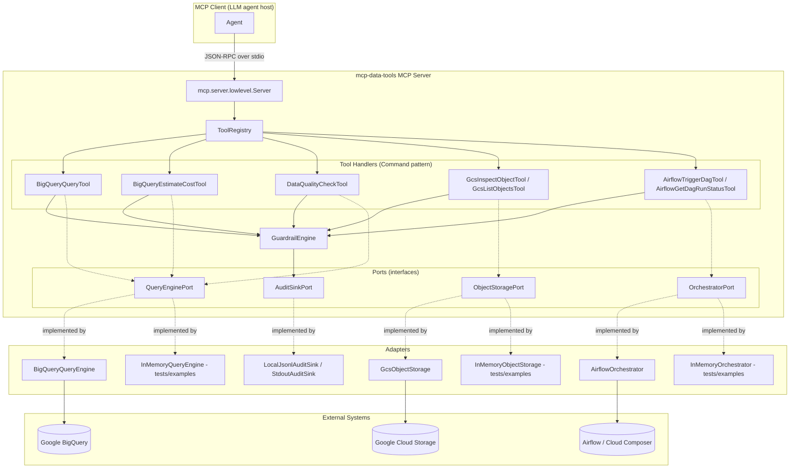
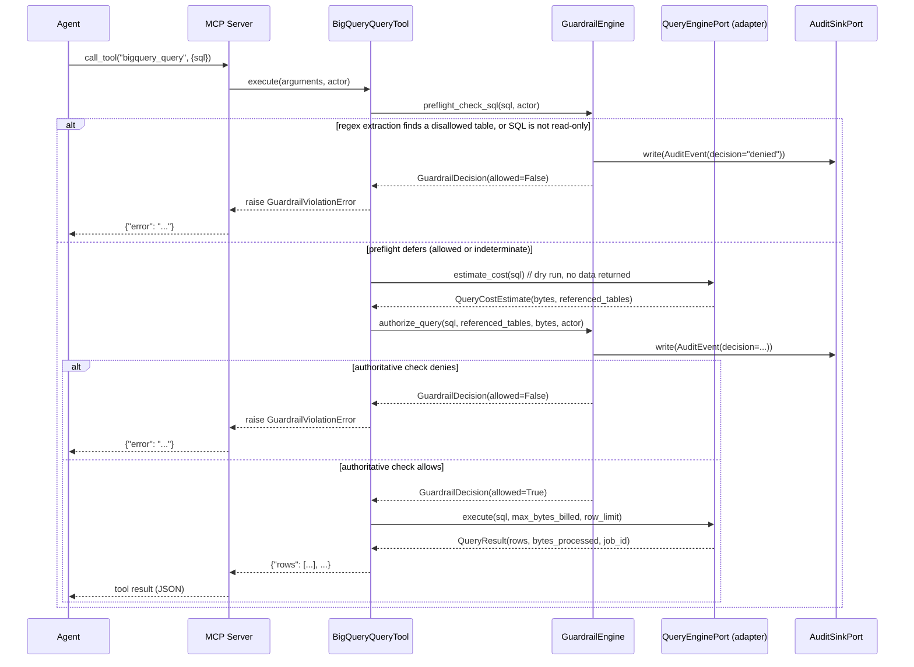

# Architecture

## Overview

`mcp-data-tools` is a hexagonal ("ports and adapters") application. The
domain — tool handlers and the guardrail engine — depends only on
abstract interfaces (`ports/interfaces.py`). Concrete integrations
(BigQuery, GCS, Airflow, audit sinks) are adapters plugged in at the
composition root (`server/factory.py`). This is what lets the entire tool
and guardrail layer be unit-tested with zero network access and zero
cloud credentials, using the in-memory mock adapter for each port.

## Request sequence: a guarded BigQuery query

The two-phase guardrail check (see `docs/SECURITY.md` for the full
rationale) is the central design decision in this codebase, so it's worth
tracing end to end.

## Component responsibilities

| Package | Responsibility | Depends on |
|---|---|---|
| `core` | Config models, exceptions, structured logging, retry policy, secret resolution | Nothing internal |
| `ports` | Abstract interfaces + domain models (dataclasses) | `core` |
| `adapters` | Real + mock implementations of each port | `core`, `ports` |
| `guardrails` | Policy evaluation (allow-list, SQL read-only check, cost ceilings) + audit recording | `core`, `ports` |
| `tools` | MCP tool handlers (Command pattern); orchestrates adapter + guardrail calls | `core`, `ports`, `guardrails` |
| `server` | Composition root (factory) + MCP protocol wiring + CLI | Everything above |

Dependencies only point downward in this table — `guardrails` never
imports from `tools`, `adapters` never import from `guardrails` or
`tools`, etc. This is enforced by convention and code review today (see
`CONTRIBUTING.md`); a future enhancement is an import-linter rule in CI
(see `docs/ROADMAP` in the README).

## Design decisions and trade-offs

### Why a hand-rolled retry decorator instead of `tenacity`?

`core/retry.py` is deliberately small and dependency-free. For a project
whose entire premise is "govern and audit calls to external systems,"
every dependency in the retry/backoff path is something a reviewer has to
trust. Twenty lines of exponential backoff with jitter is easy to audit
in full; a general-purpose retry library carries surface area (custom
wait strategies, stop conditions, callback hooks) this project doesn't
need. Trade-off: if requirements grow (e.g. circuit breakers), revisit.

### Why regex-based SQL analysis instead of a real SQL parser?

Using `sqlglot` or similar would make the read-only/table-extraction
checks more correct against exotic SQL. It was deliberately *not* adopted
for v0.1 for two reasons: (1) it would create a false sense of
completeness — a "real" SQL parser still doesn't know about views,
stored-procedure side effects, or dialect-specific extensions, so it
doesn't actually close the gap that matters (see `SECURITY.md`); and
(2) the authoritative check already runs against the backend's own
resolution of referenced tables post-dry-run, which is strictly more
correct than any client-side parser. The regex layer exists purely as a
fast-fail optimization and a probing-prevention measure, and is documented
as such. Revisit if check sophistication (e.g. column-level policies)
grows enough to need real parsing.

### Why in-memory mock adapters instead of mocking with `unittest.mock`?

A hand-written fake that implements the full port interface
(`InMemoryQueryEngine`, etc.) catches interface drift at import time (if
the port interface changes, the mock's method signatures must change with
it, and a linter/mypy will flag mismatches) in a way that a `MagicMock()`
cannot. It also makes tests read as documentation: `engine.seed_table(...)`
is clearer than the assemblage of `.return_value` chains a full mock-based
test would need.

### Why does `ToolRegistry` take already-constructed adapters instead of
### building them itself?

Constructor injection (rather than the registry reading `AppConfig` and
building its own adapters) keeps `ToolRegistry` trivially testable — see
`tests/unit/test_tools_registry.py`, which passes `InMemoryQueryEngine()`
directly. The actual "read config, decide which adapters to build"
concern is a *separate* responsibility, isolated to
`server/factory.py`, following the Single Responsibility Principle.

## Extensibility

- **New data-quality check**: implement `CheckStrategy`
  (`tools/data_quality/strategies.py`) and add it to `CHECK_STRATEGIES`.
  No other module changes.
- **New query backend** (e.g. Databricks SQL): implement
  `QueryEnginePort` in `adapters/databricks/adapter.py` with a matching
  mock, and wire it in `server/factory.py`. `tools/bigquery_tools.py`
  would be renamed/generalized, or a parallel `tools/databricks_tools.py`
  added, reusing the same `GuardrailEngine`.
- **New guardrail dimension** (e.g. per-actor rate limiting): add a check
  method to `GuardrailEngine` following the existing `authorize_*` /
  `preflight_*` pattern; every check writes exactly one `AuditEvent`.
